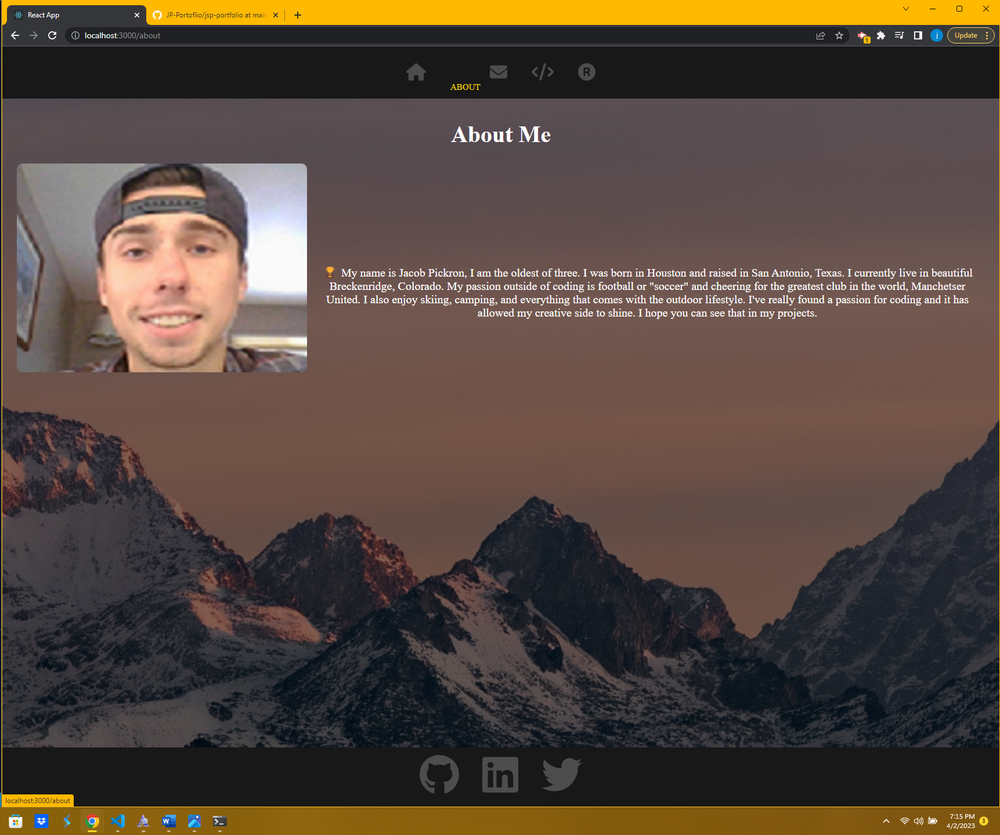
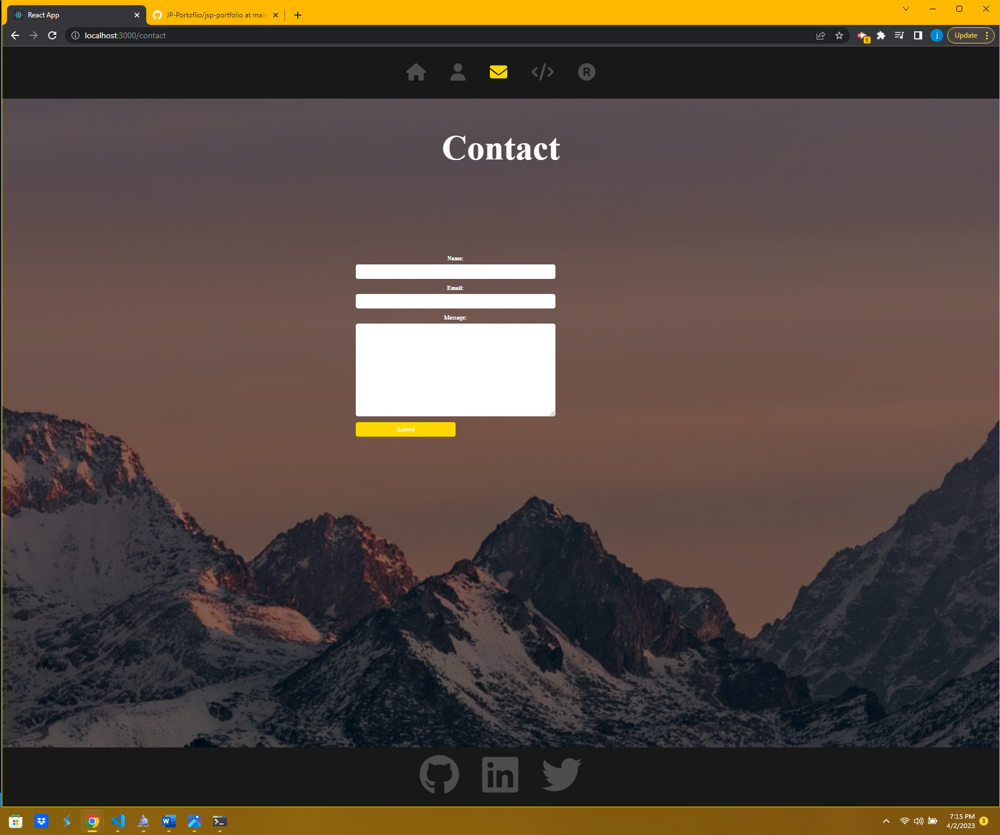
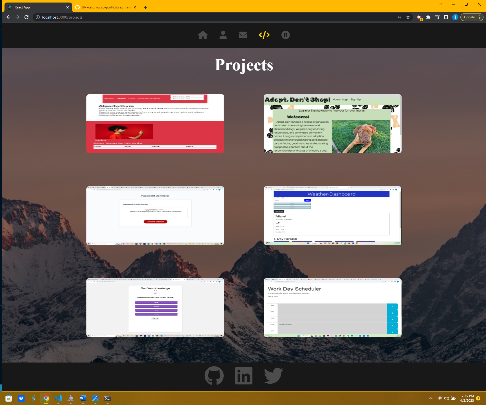

# JP-Portfolio 

  ## Description
  A React version of my Portfolio, going to keep updating as I go.

  ## Table of Contents

  - [installation](#installation)

  - [usage](#usage)

  - [license](#license)

  - [test](#test)

  - [contrabution](#contrabution)

  - [questions](#questions)

  ## Installation
  Users must downlaod the correct npm packeges: react, scss, forawesome svg icons, and animate.css

  ## Usage
  Users must go into their terminal and run the following command: npm start

  ## License
  MIT

  ## Test
  You can run test in the terminal by running the command: npm test

  ## Contrabution
  Users can contrabute to this application through my GitHub issues.

  ## Questions
  [jpick77](https://github.com/jpick77)

  jpickron30@gmail.com

  ## Screenshots
 
 
  
